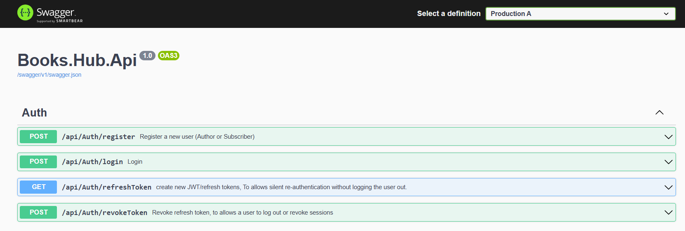
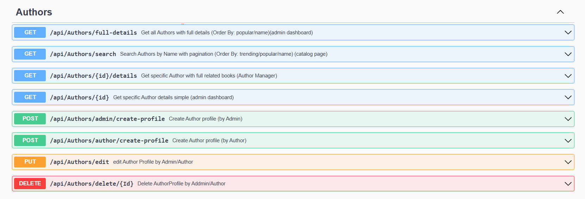
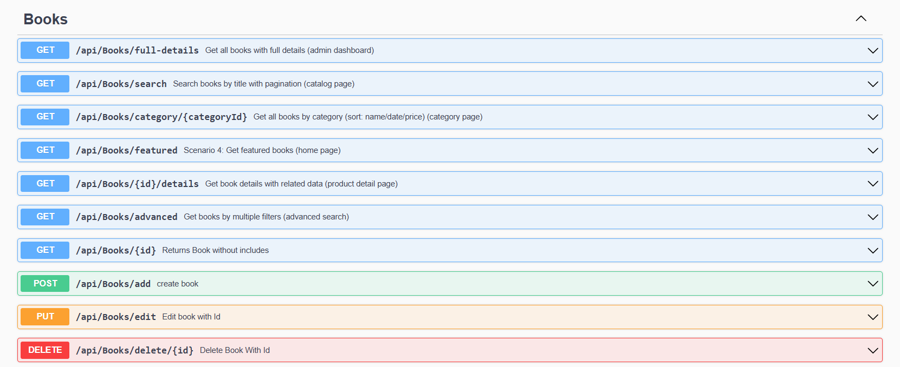
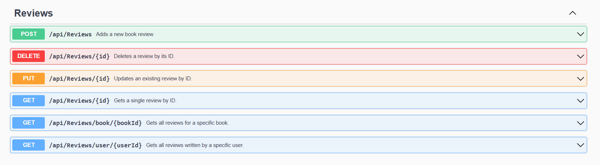
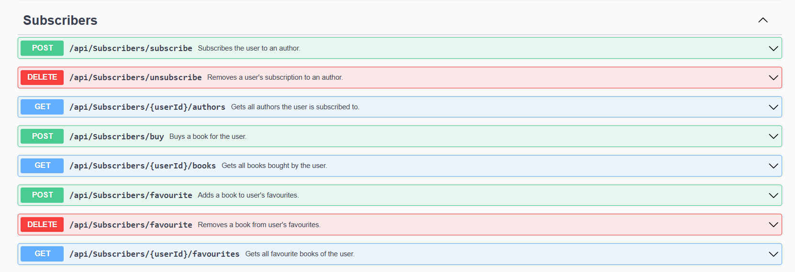
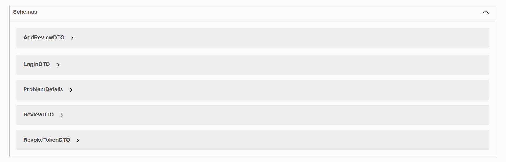

# 📚 BooksHub – .NET 8 Web API


BooksHub is a .NET 8 Web API for an online book library and store. It supports role-based access (Admin, Author, Subscriber), book management, subscriptions, reviews, favorites, and much more — following Clean Architecture best practices.

✅ Swagger docs available at https://bookshub.tryasp.net/

---

## ✨ Features

- 🔐 JWT Authentication with Refresh Tokens
- 🧑 Admin, Author, and Subscriber roles
- ✍️ Admin can manage categories, books, authors (living and historic)
- 📚 Author accounts can create Author Profiles to publish their books
- 👥 Subscribers can:
  - Subscribe to author profiles
  - Add books to favorites
  - Purchase books
  - Review books
- 📦 Global exception handling & request rate limiting
- 🧪 Full unit testing with xUnit, FakeItEasy, FluentAssertions
- 📜 Swagger UI enabled
- 🧠 Middleware profiling and execution timing
- 🛡️ Role seeding and default Admin user
- 🧩 Modular and extensible with SOLID, DRY, KISS, YAGNI principles

---

## 🧱 Tech Stack

| Layer              | Technologies                                                                 |
|-------------------|------------------------------------------------------------------------------|
| **Backend**        | .NET 8 Web API, Entity Framework Core, SQL Server                           |
| **Authentication** | ASP.NET Core Identity, JWT (Bearer Tokens), Refresh Token Support           |
| **Architecture**   | Clean Architecture (4-tier): API, Application, Domain, Infrastructure        |
| **Utilities**      | Custom Mappers, Action Filters, Options Pattern, Middleware             |
| **Testing**        | xUnit, FakeItEasy, FluentAssertions                                          |
| **Docs & Logs**    | Swagger, Serilog                                                             |

---

### 📁 Project Structure
```
BooksHub
│
├── BooksHub.API # Entry point, Controllers, Middleware, Swagger
├── BooksHub.Application # DTOs, Interfaces, Services, Business Logic
├── BooksHub.Domain # Core Entities, Enums, Contracts
├── BooksHub.Infrastructure # EF Core DbContext, Repositories, Identity, Configurations
└── BooksHub.Tests # Unit Tests for repositories, controllers and Middlewares
```


---

## 🚀 Getting Started

### Prerequisites

- [.NET 8 SDK](https://dotnet.microsoft.com/en-us/download/dotnet/8.0)
- [SQL Server](https://www.microsoft.com/en-us/sql-server/sql-server-downloads)
- Visual Studio / VS Code

---

### 🔧 Setup Instructions

```
  # 1. Clone the repository
  git clone https://github.com/your-username/BooksHub.git
  cd BooksHub
  
  # 2. Set connection string & JWT secret in appsettings.Development.json
  #    - "DefaultConnection"
  #    - "JWT:Key"
  
  # 3. Apply EF Core migrations
  dotnet ef database update --project BooksHub.Infrastructure
  
  # 4. Run the application
  dotnet run --project BooksHub.API
```

✅ Swagger docs available at https://bookshub.tryasp.net/

---

## 🔐 Authentication & Seeding

- ✅ On first run:

    + AppRoles are seeded (Admin, Author, Subscriber)

    + Admin user is seeded (you can update email/password in the seeder)

    + Categories seeded via migration

- JWT tokens issued on login

- Refresh tokens handled via /auth/refresh-token endpoint

---

## 🧪 Testing
Run unit tests using:
``` bash
  dotnet test
```

- Frameworks: xUnit, FakeItEasy, FluentAssertions

- Coverage: Middlewares, Repositories, Controllers

---

## 🧰 Extra Features
- 🧠 Execution Time Filter: Tracks time taken by each controller action.

- 🔥 Rate Limiting Middleware: Allows max 5 requests per 10 seconds per IP.

- 💥 Global Exception Middleware: Catches and handles all unhandled exceptions.

- 🧾 JWT & Image Options: Configured via IOptions.

- 🖼️ Image Validation: Validates size and extension before upload.

- 🧬 Custom AutoMapper Replacement: Lightweight object mapping.

- 🔐 IdentitySeederExtension & JwtAuthenticationExtension: Simplifies startup logic.

---

## 🧭 Roadmap

- ✅ Backend API (current)

- 🔄 Add CQRS support

- 📦 Docker support for local development

- ⚙️ CI/CD pipeline (GitHub Actions or Azure DevOps)

- 🌐 Frontend (React or Next.js)

---

## 🖼️ Screenshots








---

## 👤 Author
Mohamed Eltorky
.NET Backend Developer
📫 Contact: [m.eltorky1014@gmail.com]


